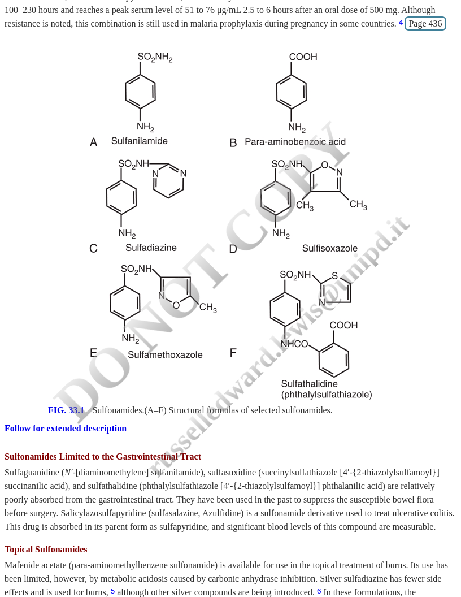
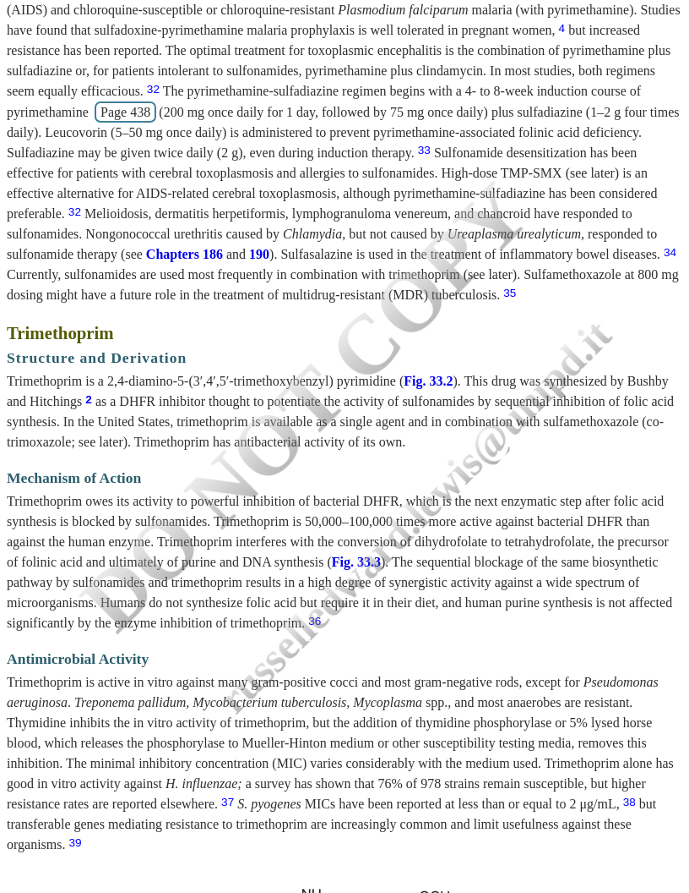

## Learning Objectives (1 of 2) {.smaller}

By the end of this lecture, you should be able to:

::: {.incremental}
1. Describe the history and development of sulfonamides
2. Explain the chemical structure-activity relationships of sulfonamides
3. Describe the mechanism of action of sulfonamides and trimethoprim
4. Explain the basis for synergy in TMP-SMX combination
:::

::: {.notes}
Part 1 of learning objectives focuses on the basic science of these drugs. Understanding the mechanism is critical for understanding clinical applications and resistance patterns.
:::

---

## Learning Objectives (2 of 2) {.smaller}

::: {.incremental}
5. List the major mechanisms of resistance to sulfonamides and trimethoprim
6. Describe the pharmacokinetics and tissue distribution
7. Recognize common and serious adverse reactions
8. Identify appropriate clinical indications for TMP-SMX
9. Manage drug interactions and special populations
:::

::: {.notes}
Part 2 focuses on clinical applications - resistance patterns, pharmacology, adverse effects, and practical prescribing.
:::

---

# PART 1: History and Discovery {background-color="#2c3e50"}

::: {.notes}
We begin with the historical context - understanding why sulfonamides were revolutionary and how they shaped modern antimicrobial therapy.
:::

---

## The Birth of Antimicrobial Chemotherapy

:::: {.columns}
::: {.column width="60%"}
- **1932**: Gerhard Domagk discovers Prontosil
- First synthetic antimicrobial agent
- German dye industry origin
- Protected mice from *Streptococcus pyogenes*
:::

::: {.column width="40%"}
<!-- IMAGE NEEDED: Portrait of Domagk or Prontosil structure -->
:::
::::

::: {.notes}
Domagk was working for I.G. Farbenindustrie when he discovered that the red dye Prontosil protected mice from streptococcal infections. He received the Nobel Prize in 1939, though the Nazi regime forced him to decline it initially.
:::

---

## Prontosil to Sulfanilamide

- Prontosil was a **prodrug**
- Active metabolite: **sulfanilamide**
- Released in vivo through azo bond cleavage
- First use in US: July 1935
  - 10-year-old girl with *H. influenzae* meningitis
  - Unfortunately unsuccessful (too late in disease)

::: {.notes}
The French team of Tréfouël discovered that the active compound was actually sulfanilamide, not the parent dye. This was important because sulfanilamide couldn't be patented, leading to widespread availability.
:::

---

## Evolution of Sulfonamides

| Decade | Development |
|--------|-------------|
| 1930s | Basic sulfanilamide modifications |
| 1940s | Sulfadiazine for systemic infections |
| 1950s | Trimethoprim synthesis (Hitchings) |
| 1960s | TMP-SMX combination introduced |
| 1970s+ | Prophylaxis for opportunistic infections |

::: {.notes}
Sulfonamides were the dominant antimicrobials before penicillin became widely available. Even today, in combination with trimethoprim, they remain clinically valuable.
:::

---

# PART 2: Sulfonamide Chemistry and Structure {background-color="#2c3e50"}

---

## Sulfonamide Structure Basics

:::: {.columns}
::: {.column width="50%"}
**Key structural features:**

- Benzene ring core
- Sulfonamide group (-SO₂NH₂)
- Free amino group at 4-carbon
- Similar to PABA
:::

::: {.column width="50%"}

:::
::::

::: {.notes}
The structural similarity to para-aminobenzoic acid (PABA) is the key to understanding the mechanism of action. The free amino group at the 4-carbon position is essential for activity.
:::

---

## Structure-Activity Relationships

**Activity-enhancing modifications:**

::: {.incremental}
- Free 4-amino group → **Essential** for activity
- Sulfonyl (SO₂) substitutions → Increased PABA inhibition
- Examples: sulfadiazine, sulfisoxazole, sulfamethoxazole
:::

**Activity-decreasing modifications:**

::: {.incremental}
- N-1 substitutions → Decreased GI absorption
- Example: phthalylsulfathiazole (stays in GI tract)
:::

::: {.notes}
The nature of substitutions determines not only activity but also pharmacokinetic properties like absorption, solubility, and protein binding.
:::

---

## Classification of Sulfonamides

| Class | Examples | Key Features |
|-------|----------|--------------|
| Short/medium-acting | Sulfisoxazole, SMX | Most common, systemic |
| Long-acting | Sulfadoxine | T½ 100-230 hrs, malaria |
| GI-limited | Sulfasalazine | Poorly absorbed, IBD |
| Topical | Silver sulfadiazine | Burns, wounds |

::: {.notes}
This classification is clinically useful. Short-acting agents are the most commonly used. Long-acting agents fell out of favor due to Stevens-Johnson syndrome risk but remain useful for malaria.
:::

---

## Sulfamethoxazole: The Most Important

- *N'*-(5-methyl-3-isoxazolyl) sulfanilamide
- Less soluble than sulfisoxazole
- Higher blood levels achieved
- **The sulfonamide in TMP-SMX**
- Half-life ~11 hours (matches TMP)

::: {.notes}
Sulfamethoxazole was chosen for the TMP combination specifically because its pharmacokinetic profile (particularly half-life) closely matches that of trimethoprim, making it ideal for twice-daily dosing.
:::

---

# PART 3: Mechanism of Action {background-color="#2c3e50"}

---

## The Folic Acid Pathway



::: {.notes}
This pathway diagram is crucial for understanding how sulfonamides and trimethoprim work together. Note the two sequential steps that are blocked.
:::

---

## Step 1: Sulfonamide Action

**Target:** Dihydropteroate synthase (DHPS)

::: {.incremental}
- Sulfonamides are PABA analogs
- Competitive inhibition of PABA incorporation
- Can be incorporated into dihydropteroate
- **Result:** Decreased dihydrofolic acid synthesis
:::

::: {.notes}
Sulfonamides may actually have higher affinity for DHPS than the natural substrate PABA. They may also be incorporated into abnormal folate intermediates.
:::

---

## Step 2: Trimethoprim Action

**Target:** Dihydrofolate reductase (DHFR)

::: {.incremental}
- Blocks conversion of dihydrofolate → tetrahydrofolate
- 50,000-100,000x more active against bacterial vs human DHFR
- **Selective toxicity** is key
- Result: Decreased tetrahydrofolic acid
:::

::: {.notes}
The remarkable selectivity of trimethoprim for bacterial DHFR over human DHFR is the basis for its therapeutic index. Human cells obtain folic acid from the diet and don't require the synthesis pathway.
:::

---

## Sequential Blockade = Synergy

```{mermaid}
flowchart LR
    A[PABA] -->|DHPS| B[Dihydrofolic acid]
    B -->|DHFR| C[Tetrahydrofolic acid]
    C --> D[Purines + DNA]

    S[Sulfonamides] -.->|Block| A
    T[Trimethoprim] -.->|Block| B
```

**Why synergy occurs:**

- Dual pathway blockade
- Bacteriostatic → Bactericidal effect
- Reduced resistance emergence

::: {.notes}
The combination of sulfonamide plus trimethoprim blocks two sequential steps in the same pathway. This creates true synergy - the combination is more effective than the sum of individual effects.
:::

---

## Key Concept: Bacteriostatic vs Bactericidal

| Property | Sulfonamide Alone | TMP Alone | TMP-SMX |
|----------|:-----------------:|:---------:|:-------:|
| Effect | Bacteriostatic | Bacteriostatic | **Bactericidal** |
| Inhibition | DHPS | DHFR | Both |
| Resistance | Higher risk | Higher risk | Lower risk |

::: {.notes}
The synergistic combination achieves bactericidal activity against many organisms that either agent alone would only inhibit. This is clinically relevant for serious infections.
:::

---

## Why Humans Are Spared

**Selective toxicity explained:**

::: {.incremental}
1. Humans cannot synthesize folic acid
2. Humans obtain folate from diet
3. Human DHFR has very low affinity for TMP
4. Mammalian cells take up preformed folate
:::

::: {.callout-tip}
High doses or prolonged therapy can still cause folate deficiency - supplement with leucovorin when needed
:::

::: {.notes}
This is why TMP-SMX is generally well-tolerated despite blocking such fundamental metabolic pathways. However, prolonged high-dose therapy can deplete folate stores, especially in malnourished patients.
:::

---

# PART 4: Antimicrobial Spectrum and Resistance {background-color="#2c3e50"}

---

## Spectrum of Activity

**Gram-positive:**

- *S. aureus* (including many CA-MRSA)
- *S. pneumoniae* (resistance increasing)
- *Listeria monocytogenes*
- *Nocardia* species

**Gram-negative:**

- Most *Enterobacterales*
- *H. influenzae*
- *Stenotrophomonas maltophilia*
- NOT *Pseudomonas aeruginosa*

::: {.notes}
TMP-SMX has an impressively broad spectrum. Notable gaps include Pseudomonas and most anaerobes. The activity against MRSA and Stenotrophomonas is particularly valuable clinically.
:::

---

## Activity Against Special Pathogens

| Organism | Activity | Clinical Use |
|----------|:--------:|--------------|
| *Pneumocystis jirovecii* | +++ | First-line |
| *Toxoplasma gondii* | ++ | Alternative |
| *Nocardia* spp. | +++ | First-line |
| *Stenotrophomonas* | +++ | First-line |
| *Isospora/Cyclospora* | +++ | First-line |

::: {.notes}
These special pathogens are where TMP-SMX really shines. For PCP and Nocardia, it's the drug of choice. For Stenotrophomonas, it's often the only oral option.
:::

---

## Resistance: The Growing Problem

**Resistance rates are increasing:**

::: {.incremental}
- *E. coli* (UTI isolates): 20-30% resistant in many areas
- *S. pneumoniae*: 25-50% resistant globally
- *Shigella*: >30% resistant in US, >75% in China
- *Salmonella*: Majority of isolates now resistant
:::

::: {.callout-warning}
Always check local resistance patterns before empiric therapy!
:::

::: {.notes}
The once-reliable activity of TMP-SMX against common pathogens is being eroded by resistance. This is why it's no longer first-line for many UTIs in high-resistance areas.
:::

---

## Mechanisms of Resistance

**Sulfonamide resistance:**

::: {.incremental}
1. Point mutations in *folP* gene (altered DHPS)
2. PABA overproduction
3. Plasmid-mediated *sul1*, *sul2*, *sul3* genes
4. Decreased cell permeability
:::

::: {.notes}
Multiple mechanisms can operate simultaneously. The sul genes are particularly concerning as they're often carried on mobile genetic elements like integrons.
:::

---

## Mechanisms of Resistance (continued)

**Trimethoprim resistance:**

::: {.incremental}
1. Point mutations in *dfrA* gene (altered DHFR)
2. Plasmid-mediated *dfr* genes (>30 variants!)
3. DHFR overproduction
4. Decreased permeability
:::

::: {.callout-important}
Cross-resistance between sulfonamides is common; resistance to one = resistance to all
:::

::: {.notes}
The large number of dfr gene variants (over 30 identified) reflects the strong selective pressure that has been applied to these drugs over decades of use.
:::

---

# PART 5: Pharmacology {background-color="#2c3e50"}

---

## Pharmacokinetics Overview

| Parameter | TMP | SMX |
|-----------|:---:|:---:|
| Bioavailability | >90% | >90% |
| T~max~ | 1-4 hr | 1-4 hr |
| Half-life | 8-10 hr | 9-11 hr |
| Protein binding | 45% | 70% |
| CSF penetration | 40-50% | 25-50% |

::: {.notes}
The matched pharmacokinetics of TMP and SMX make them ideal combination partners. Both have excellent oral bioavailability and penetrate well into tissues.
:::

---

## The Magic of the 1:5 Ratio

**Fixed-dose combination:**

- TMP 160 mg + SMX 800 mg = **DS tablet**
- Produces serum ratio ~1:20
- Optimal for synergy against most pathogens

**Why this ratio?**

::: {.incremental}
- Accounts for different protein binding
- Accounts for different tissue distribution
- Maximizes bactericidal synergy
:::

::: {.notes}
The 1:5 ratio in the tablet produces approximately a 1:20 ratio in serum due to the different protein binding and distribution characteristics. This was carefully optimized in early clinical trials.
:::

---

## Tissue Distribution

**Excellent penetration into:**

- Cerebrospinal fluid (40-50%)
- Prostatic tissue
- Respiratory secretions
- Middle ear fluid
- Synovial fluid
- Pleural and peritoneal fluids

::: {.callout-tip}
Good CNS penetration makes TMP-SMX useful for:
- Toxoplasmic encephalitis
- Nocardia brain abscess
:::

::: {.notes}
The good tissue penetration, especially into CSF, is a major advantage. Many antibiotics do not penetrate the CNS well, limiting their usefulness for these serious infections.
:::

---

## Metabolism and Elimination

**Trimethoprim:**

- 50-70% excreted unchanged in urine
- Hepatic metabolism (minor)
- Active tubular secretion

**Sulfamethoxazole:**

- Hepatic acetylation and glucuronidation
- 15-30% excreted unchanged in urine
- Metabolized by CYP2C9

::: {.notes}
Both components have significant renal excretion, which is why dose adjustment is needed in renal impairment. The high urinary concentrations also explain the effectiveness for UTIs.
:::

---

## Renal Dosing Adjustments

| CrCl (mL/min) | Dose Adjustment |
|:-------------:|-----------------|
| >30 | Full dose |
| 15-30 | 50% reduction |
| <15 | Avoid (or 50% q24h with monitoring) |

**Hemodialysis:** Give dose after dialysis

::: {.callout-warning}
Monitor creatinine closely - TMP can increase serum creatinine by blocking tubular secretion (not true nephrotoxicity)
:::

::: {.notes}
The creatinine increase from TMP is a pharmacokinetic effect, not true nephrotoxicity. TMP blocks the tubular secretion of creatinine, raising serum levels without affecting true GFR. However, actual nephrotoxicity (interstitial nephritis) can also occur.
:::

---

# PART 6: Adverse Effects {background-color="#2c3e50"}

---

## Common Adverse Effects

**Gastrointestinal (most common):**

- Nausea, vomiting
- Anorexia
- Diarrhea

**Dermatologic:**

- Rash (3-5% general population)
- Much higher in HIV (50-60%)
- Usually maculopapular

::: {.notes}
GI side effects are the most common reason for discontinuation in clinical practice. Taking with food may help. The dramatically higher reaction rate in HIV patients is important to anticipate.
:::

---

## Serious Adverse Effects

::: {.callout-important}
## Life-Threatening Reactions

1. **Stevens-Johnson Syndrome / TEN**
   - Mortality up to 30-40% for TEN
   - Usually within first 8 weeks

2. **Severe hematologic toxicity**
   - Agranulocytosis
   - Aplastic anemia
   - Thrombocytopenia

3. **Anaphylaxis**
:::

::: {.notes}
SJS/TEN is the most feared complication. Risk factors include HIV infection and certain HLA types. If a patient develops a severe rash, stop the drug immediately and never rechallenge.
:::

---

## Hyperkalemia: An Underappreciated Risk

**Mechanism:**

- TMP blocks ENaC sodium channel
- Acts like potassium-sparing diuretic
- Occurs at therapeutic doses

**Risk factors:**

::: {.incremental}
- Renal insufficiency
- Age >65 years
- ACE inhibitors or ARBs
- Higher TMP doses
- Diabetes mellitus
:::

::: {.notes}
Hyperkalemia from TMP-SMX is more common than many clinicians realize. Multiple studies have shown increased sudden death risk in patients on ACEi/ARBs who receive TMP-SMX, likely due to hyperkalemia.
:::

---

## Hyperkalemia Management

| Potassium Level | Action |
|:---------------:|--------|
| <5.5 mEq/L | Monitor |
| 5.5-6.0 mEq/L | Recheck, consider dose reduction |
| 6.0-6.5 mEq/L | Stop TMP-SMX, dietary K+ restriction |
| >6.5 mEq/L | Aggressive treatment, alternative antibiotic |

::: {.callout-tip}
Check potassium within first week in high-risk patients!
:::

::: {.notes}
Routine potassium monitoring is especially important in patients on ACE inhibitors, ARBs, or with renal impairment. Most cases of significant hyperkalemia occur within the first 7-10 days.
:::

---

## Hematologic Toxicity

**Folate-related:**

- Megaloblastic anemia
- Leukopenia
- Thrombocytopenia
- Risk increases with duration

**Prevention:**

- Supplemental leucovorin (folinic acid) for high-dose/prolonged therapy
- Especially important in malnourished patients

::: {.notes}
The hematologic effects are related to folate depletion. They're usually reversible with drug discontinuation. Leucovorin can bypass the folate synthesis block without reducing antibacterial efficacy.
:::

---

## Special Population: HIV Patients

**Much higher adverse reaction rates:**

::: {.incremental}
- Rash: 50-60% (vs 3-5%)
- Fever common
- Often occurs after 1-2 weeks
- May tolerate rechallenge or desensitization
:::

**Despite reactions, TMP-SMX remains:**

- First-line PCP prophylaxis
- First-line PCP treatment
- Benefits outweigh risks

::: {.notes}
The high reaction rate in HIV patients was noted early in the AIDS epidemic. The mechanism is unclear but may relate to altered drug metabolism, immune dysregulation, or increased oxidative stress.
:::

---

## Pregnancy Considerations

::: {.callout-warning}
## Avoid in Late Pregnancy

- Sulfonamides compete for bilirubin binding sites
- Risk of neonatal hyperbilirubinemia
- **Kernicterus risk** in newborn
- Also avoid in breastfeeding
:::

**First trimester:**

- Some studies suggest neural tube defect risk
- Consider folate supplementation if used

::: {.notes}
The kernicterus risk is specific to the neonatal period when the blood-brain barrier is immature and bilirubin encephalopathy can occur. TMP-SMX should be avoided after 32 weeks of pregnancy.
:::

---

# PART 7: Drug Interactions {background-color="#2c3e50"}

---

## Major Drug Interactions

| Drug | Effect | Mechanism |
|------|--------|-----------|
| Warfarin | ↑ INR | CYP2C9 inhibition |
| Methotrexate | ↑ Toxicity | Protein displacement, DHFR inhibition |
| Phenytoin | ↑ Levels | CYP2C9 inhibition |
| Sulfonylureas | ↑ Hypoglycemia | Protein displacement |

::: {.notes}
The warfarin interaction is probably the most clinically important. Always reduce warfarin dose when starting TMP-SMX and monitor INR closely.
:::

---

## Drug Interactions (continued)

| Drug | Effect | Management |
|------|--------|------------|
| ACEi/ARBs | ↑ Hyperkalemia | Monitor K+ |
| Dofetilide | ↑ QT prolongation | **Contraindicated** |
| Cyclosporine | ↓ Levels | Monitor |
| Digoxin | ↑ Levels | Monitor |

::: {.callout-important}
TMP-SMX + Dofetilide = **Absolute contraindication**
:::

::: {.notes}
Dofetilide is eliminated by renal cation transporters that TMP inhibits, leading to dangerous accumulation and QT prolongation. This is a hard contraindication.
:::

---

# PART 8: Clinical Applications {background-color="#2c3e50"}

---

## PCP: The Most Important Indication

**Pneumocystis jirovecii Pneumonia:**

::: {.incremental}
- **Treatment:** 15-20 mg/kg/day TMP, 21 days
- **Prophylaxis:** 1 DS tablet daily (or 3x/week)
- First-line for both
- Add steroids if PaO₂ <70 mmHg
:::

**Prophylaxis indications:**

- HIV with CD4 <200 cells/µL
- Other immunocompromising conditions
- Solid organ transplant recipients

::: {.notes}
TMP-SMX prophylaxis dramatically reduced PCP mortality in the HIV epidemic. Today it remains essential for immunocompromised patients. The 3x weekly dosing is often better tolerated with similar efficacy.
:::

---

## Urinary Tract Infections

**Uncomplicated cystitis:**

- 1 DS tablet BID × 3 days
- **Only if local resistance <20%**

**Pyelonephritis:**

- 1 DS tablet BID × 7-14 days
- If susceptible

::: {.callout-warning}
Check your local antibiogram! Many areas now have E. coli resistance >20%
:::

::: {.notes}
TMP-SMX was once first-line for UTIs everywhere. Now, due to resistance, IDSA guidelines recommend it only in areas where resistance remains below 20%. Fluoroquinolones or nitrofurantoin may be preferred.
:::

---

## Skin and Soft Tissue Infections

**Community-acquired MRSA:**

::: {.incremental}
- TMP-SMX has good CA-MRSA activity
- 1-2 DS tablets BID × 5-10 days
- Often combined with I&D for abscesses
- Useful oral step-down option
:::

**Advantages:**

- Oral bioavailability
- Good tissue penetration
- Often susceptible when other agents fail

::: {.notes}
TMP-SMX has become a key agent for CA-MRSA skin infections because it's oral, well-tolerated, and usually effective. However, it lacks activity against streptococci, so consider coverage gaps.
:::

---

## Nocardiosis

**First-line therapy:**

::: {.incremental}
- TMP-SMX preferred
- High doses: 15-20 mg/kg/day TMP
- Duration: 6-12 months (or longer)
- May combine with other agents for severe disease
:::

**Alternative:** Imipenem, amikacin, linezolid

::: {.notes}
Nocardiosis requires prolonged therapy due to the organism's slow growth. For CNS disease, even longer courses may be needed. TMP-SMX penetrates well into brain abscesses.
:::

---

## Stenotrophomonas maltophilia

**Often the only oral option:**

- Intrinsic multidrug resistance
- TMP-SMX usually active
- Important for step-down therapy

::: {.callout-tip}
Think about *Stenotrophomonas* in:
- ICU patients on broad-spectrum antibiotics
- Ventilator-associated pneumonia
- Malignancy patients
:::

::: {.notes}
Stenotrophomonas is notoriously resistant to carbapenems and many other agents. TMP-SMX activity is a major advantage, especially for converting IV therapy to an oral option.
:::

---

## Other Clinical Uses

| Infection | Dose | Duration |
|-----------|------|----------|
| Toxoplasmosis | High-dose | 6+ weeks |
| Traveler's diarrhea | 1 DS BID | 3-5 days |
| Isosporiasis | 1 DS QID | 10 days |
| Cyclosporiasis | 1 DS BID | 7-10 days |
| Listeria meningitis | High-dose IV | 3+ weeks |

::: {.notes}
TMP-SMX remains useful for a variety of infections beyond the major indications. For listeria, it's an important alternative for penicillin-allergic patients.
:::

---

# PART 9: Practical Prescribing {background-color="#2c3e50"}

---

## Dosing Summary

| Indication | Dose | Frequency | Duration |
|------------|------|-----------|----------|
| PCP prophylaxis | 1 DS | Daily or 3x/wk | Indefinite |
| PCP treatment | 15-20 mg/kg TMP | Q6-8h | 21 days |
| Uncomplicated UTI | 1 DS | BID | 3 days |
| SSTI | 1-2 DS | BID | 5-10 days |
| Nocardiosis | 15 mg/kg TMP | Divided | 6-12 mo |

::: {.notes}
This table provides a quick reference for common dosing regimens. Remember to adjust for renal function and monitor for adverse effects, especially with prolonged use.
:::

---

## Desensitization Protocols

**When to consider:**

- HIV patients needing PCP prophylaxis
- Previous mild-moderate reactions
- **NOT for SJS/TEN history**

**Rapid 8-hour protocol:**

- Escalating doses hourly
- Hospital setting with anaphylaxis capability
- Success rate ~70-80%

::: {.notes}
Desensitization can be life-saving for HIV patients who need PCP prophylaxis but have had prior reactions. It should only be done in a controlled setting by experienced clinicians.
:::

---

## Contraindications

**Absolute:**

::: {.incremental}
- Known hypersensitivity to sulfonamides or TMP
- History of SJS/TEN with sulfonamides
- Megaloblastic anemia from folate deficiency
- Severe hepatic or renal impairment
- Pregnancy at term (>32 weeks)
- Infants <2 months (except PCP)
:::

::: {.notes}
These contraindications should be checked before prescribing. The infant age restriction is due to immature bilirubin metabolism and kernicterus risk.
:::

---

## Monitoring Recommendations

| Parameter | Timing | Notes |
|-----------|--------|-------|
| CBC | Baseline, periodically | Cytopenias |
| Creatinine | Baseline, week 1 | May ↑ from TMP |
| Potassium | Week 1 | High-risk patients |
| LFTs | If prolonged use | Hepatotoxicity |
| INR | If on warfarin | Interaction |

::: {.notes}
The extent of monitoring depends on the patient's risk factors and duration of therapy. Short courses in healthy patients need minimal monitoring; long-term use requires more attention.
:::

---

# PART 10: Clinical Cases {background-color="#2c3e50"}

---

## Case 1: PCP Prophylaxis

**45-year-old man with HIV:**

- CD4 count: 180 cells/µL
- No prior opportunistic infections
- Taking ART with good adherence

**Question:** What prophylaxis do you recommend?

::: {.notes}
Pause for audience response. This is a straightforward indication for PCP prophylaxis.
:::

---

## Case 1: Answer

**TMP-SMX 1 DS tablet daily** (or 3x weekly)

Key points:

::: {.incremental}
- CD4 <200 = indication for PCP prophylaxis
- TMP-SMX is first-line
- Continue until CD4 >200 for 3+ months on ART
- Also provides protection against toxoplasmosis
:::

::: {.notes}
TMP-SMX prophylaxis can be discontinued once CD4 counts have been >200 for at least 3 months on effective ART. The 3x weekly dosing may be considered if daily dosing causes GI intolerance.
:::

---

## Case 2: UTI in 2025

**28-year-old woman with uncomplicated cystitis:**

- Dysuria, frequency × 2 days
- No fever
- Local E. coli TMP-SMX resistance: 35%

**Question:** Is TMP-SMX appropriate?

::: {.notes}
Pause for response. This highlights the importance of local resistance patterns.
:::

---

## Case 2: Answer

**No - local resistance too high**

Better options:

::: {.incremental}
- Nitrofurantoin 100 mg BID × 5 days
- Fosfomycin 3 g single dose
- If fluoroquinolone indicated: short course
:::

**Rule:** TMP-SMX only if local resistance <20%

::: {.notes}
This illustrates why knowing your local antibiogram is essential. TMP-SMX would have been first-line 20 years ago but is no longer appropriate in many areas.
:::

---

## Case 3: Hyperkalemia Risk

**72-year-old man with cellulitis:**

- History: DM2, CKD (CrCl 35), HTN
- Medications: lisinopril, metformin, spironolactone
- Started TMP-SMX DS BID for CA-MRSA cellulitis

**What's the concern?**

::: {.notes}
Multiple hyperkalemia risk factors: age, CKD, ACE inhibitor, and potassium-sparing diuretic!
:::

---

## Case 3: Answer

**High hyperkalemia risk!**

Risk factors present:

::: {.incremental}
- Age >65 ✓
- CKD (CrCl 35) ✓
- ACE inhibitor ✓
- Spironolactone ✓
:::

**Management:**

- Check baseline K+
- Recheck in 2-3 days
- Consider holding spironolactone during treatment
- Alternative antibiotic if K+ >5.5

::: {.notes}
This patient has essentially every risk factor for TMP-SMX induced hyperkalemia. Close monitoring and potentially holding the spironolactone would be prudent. Some might argue for a different antibiotic choice entirely.
:::

---

## Case 4: The Rash

**35-year-old HIV+ man on TMP-SMX prophylaxis:**

- Day 10: develops diffuse maculopapular rash
- No mucosal involvement
- No systemic symptoms
- Tolerating oral intake

**Options?**

::: {.notes}
This is a common scenario. The key is distinguishing mild reactions that might be managed from severe reactions requiring immediate discontinuation.
:::

---

## Case 4: Answer

**Options to consider:**

::: {.incremental}
1. **Stop TMP-SMX** and use alternative (dapsone, atovaquone)
2. **Continue with antihistamines** (mild reactions may resolve)
3. **Plan for desensitization** if alternative poorly tolerated
:::

**Red flags requiring immediate discontinuation:**

- Mucosal involvement
- Systemic symptoms
- Blistering or desquamation
- Fever >38.5°C

::: {.notes}
Without red flags, some practitioners will continue through mild rashes with symptomatic treatment, as reactions sometimes resolve spontaneously. However, close monitoring is essential.
:::

---

## Case 5: Drug Interaction

**68-year-old woman on warfarin for A-fib:**

- INR therapeutic at 2.5
- Started TMP-SMX for UTI
- Returns 5 days later with INR 5.8
- No bleeding

**What happened?**

::: {.notes}
Classic TMP-SMX + warfarin interaction. Very common in practice.
:::

---

## Case 5: Answer

**TMP-SMX inhibits CYP2C9 → ↑ warfarin levels**

Management:

::: {.incremental}
- Hold warfarin
- Vitamin K 1-2 mg PO if significant bleeding risk
- Recheck INR in 24-48 hours
- Resume warfarin at reduced dose
- **Always reduce warfarin when starting TMP-SMX**
:::

::: {.notes}
This interaction is predictable and preventable. Best practice is to empirically reduce warfarin dose by 25-50% when starting TMP-SMX and monitor INR closely.
:::

---

# Summary and Key Takeaways {background-color="#2c3e50"}

---

## Key Points to Remember (1/2)

::: {.incremental}
1. **Mechanism:** Sequential blockade of folate synthesis (DHPS + DHFR)

2. **Synergy:** Combination is bactericidal; components alone are bacteriostatic

3. **Spectrum:** Broad, but NOT Pseudomonas or anaerobes

4. **Resistance:** Increasing; always check local patterns for UTIs
:::

::: {.notes}
These are the fundamental concepts that should guide clinical use of TMP-SMX.
:::

---

## Key Points to Remember (2/2)

::: {.incremental}
5. **PCP:** First-line for both treatment and prophylaxis

6. **Adverse effects:** Higher in HIV; watch for SJS/TEN, hyperkalemia

7. **Drug interactions:** Warfarin, methotrexate, ACEi/ARBs

8. **Contraindications:** Late pregnancy, severe renal/hepatic impairment, SJS history
:::

::: {.notes}
Clinical application requires awareness of adverse effects and interactions. TMP-SMX remains valuable but must be used thoughtfully.
:::

---

## When to Choose TMP-SMX

**Excellent choice for:**

- PCP (treatment and prophylaxis)
- Nocardiosis
- Stenotrophomonas
- CA-MRSA skin infections
- UTIs (if local susceptibility high)

**Think twice if:**

- High local resistance
- Multiple hyperkalemia risk factors
- Drug interactions (warfarin, MTX)
- Late pregnancy

::: {.notes}
This slide can serve as a quick clinical decision aid. TMP-SMX remains highly valuable when used appropriately.
:::

---

## Questions?

{width="60%"}

Thank you for your attention!

**Contact information:**
russ.e.lewis@gmail.com

::: {.notes}
Open floor for questions. Be prepared to discuss specific clinical scenarios or clarify any concepts covered in the lecture.
:::

---

## References

::: {#refs}
:::
