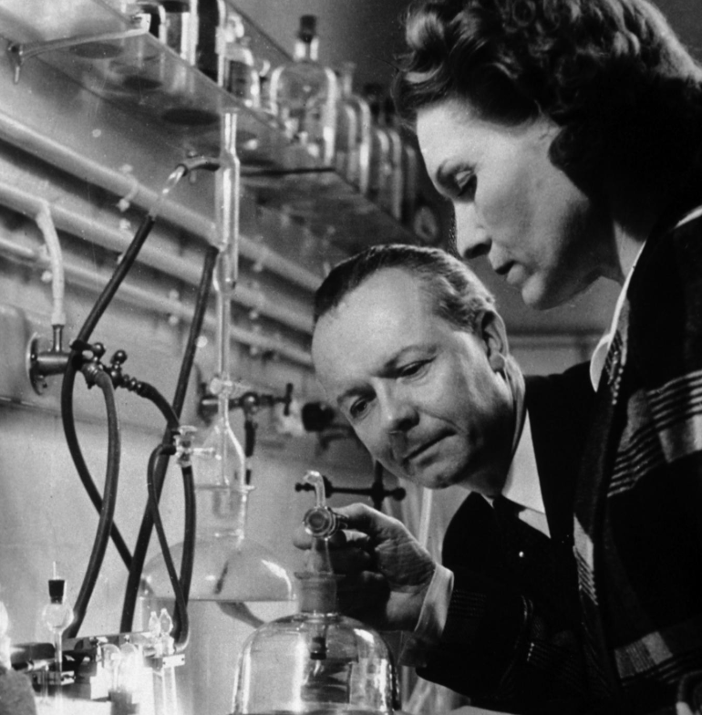
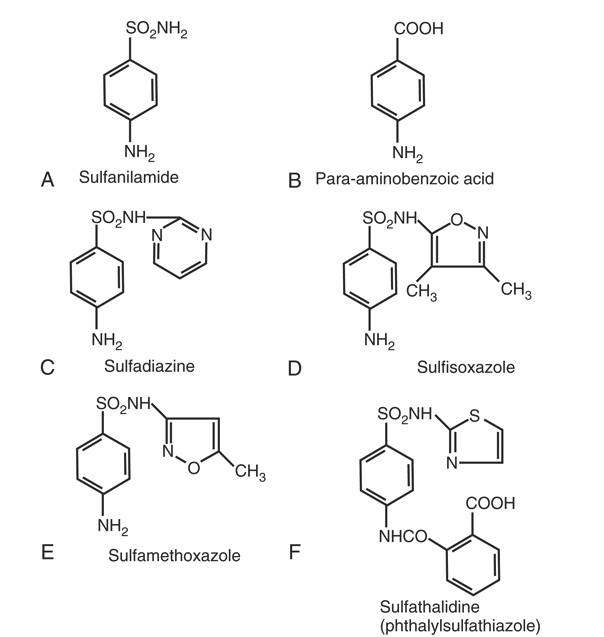
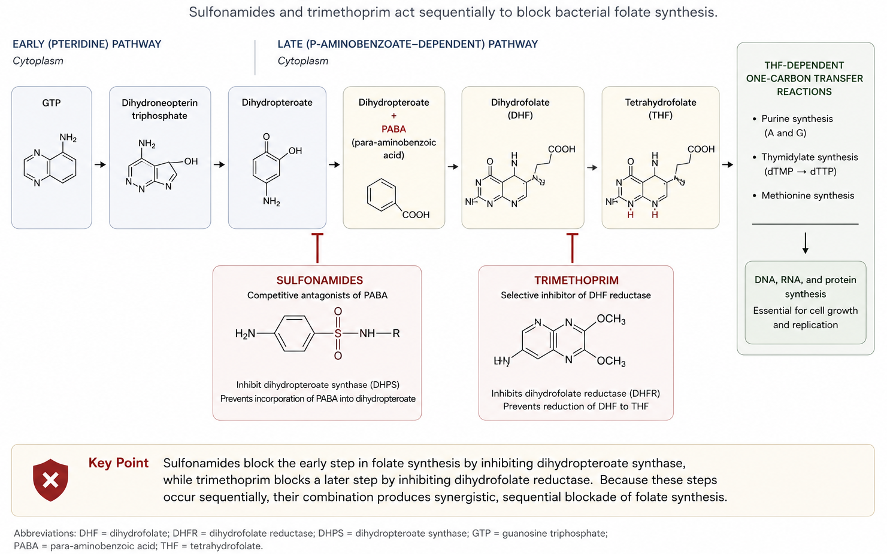
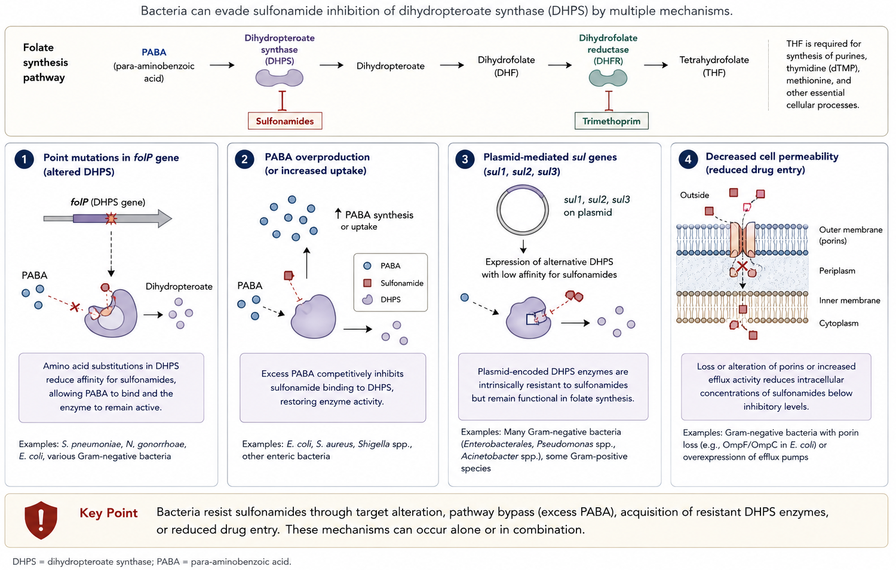
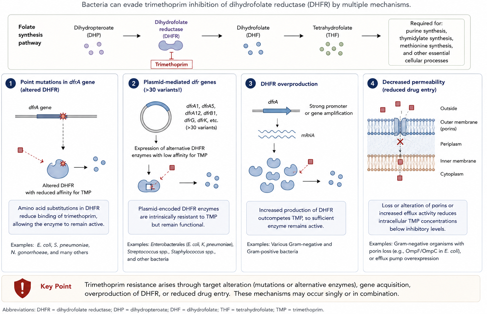

## Sulfonamides and Trimethoprim: TMP-SMX {background-video="tmp-smx-images/agar.mp4" background-video-loop="true" background-video-muted="true" background-color="#b20e10" background-opacity="0.5"}

<br>

<center>

**Russell E. Lewis, Pharm.D** <br> Associate Professor of Infectious
Diseases (MEDS-10/B) <br>

<br> <br>

{fig-align="center" width="350"}

<br>  russelledward.lewis\@unipd.it
<br> 
[https://github.com/Russlewisbo](https://github.com/Russlewisbo/ESCMID_2022_talk)
<br> Slides and course materials:
[www.idpadova.com](https://padovaid.com/)

## Learning objectives (1 of 2)

<br>

By the end of this lecture, you should be able to:

1.  Describe the history and development of sulfonamides
2.  Explain the chemical structure-activity relationships of
    sulfonamides
3.  Describe the mechanism of action of sulfonamides and trimethoprim
4.  Explain the basis for synergy in TMP-SMX combination

## Learning objectives (2 of 2)

<br>

5.  List the major mechanisms of resistance to sulfonamides and
    trimethoprim
6.  Describe the pharmacokinetics and tissue distribution
7.  Recognize common and serious adverse reactions
8.  Identify appropriate clinical indications for TMP-SMX
9.  Manage drug interactions and special populations

# PART 1: History and Discovery {background-color="#b20e10"}

## The birth of antimicrobial chemotherapy

<br>

::::: columns
::: {.column width="60%"}
- **1932**: Gerhard Domagk discovers Prontosil
- First synthetic antimicrobial agent
- German dye industry origin
- Protected mice from *Streptococcus pyogenes*
:::

::: {.column width="40%"}
{width="350"}
:::
:::::

::: aside
Domagk was working for I.G. Farbenindustrie when he discovered that the
red dye Prontosil protected mice from streptococcal infections. He
received the Nobel Prize in 1939, though the Nazi regime forced him to
decline it initially.
:::

## Prontosil to sulfanilamide

<br>

::::: columns
::: {.column width="50%"}
- Prontosil was a **prodrug**
- Active metabolite: **sulfanilamide**
- Released in vivo through azo bond cleavage
- First use in US: July 1935
  - 10-year-old girl with *H. influenzae* meningitis
  - Unfortunately unsuccessful (too late in disease)
:::

::: {.column width="50%"}
{width="350"}
:::
:::::

::: aside
The French team of Tréfouël discovered that the active compound was
actually sulfanilamide, not the parent dye. This was important because
sulfanilamide couldn't be patented, leading to widespread availability.
:::

## Evolution of sulfonamides

<br>

| Decade | Development                              |
|--------|------------------------------------------|
| 1930s  | Basic sulfanilamide modifications        |
| 1940s  | Sulfadiazine for systemic infections     |
| 1950s  | Trimethoprim synthesis (Hitchings)       |
| 1960s  | TMP-SMX combination introduced           |
| 1970s+ | Prophylaxis for opportunistic infections |

<br> <br>

::: aside
Sulfonamides were the dominant antimicrobials before penicillin became
widely available. Even today, in combination with trimethoprim, they
remain clinically valuable.
:::

# PART 2: <br> Sulfonamide Chemistry and Structure {background-color="#b20e10"}

## Sulfonamide structure basics {.smaller}

<br>

::::: columns
::: {.column width="50%"}
**Key structural features:**

- Benzene ring core
- Sulfonamide group (-SO₂NH₂)
- Free amino group at 4-carbon
- Similar to PABA
:::

::: {.column width="50%"}

:::
:::::

::: aside
The free amino group at the 4-carbon position is essential for
activity.The illustration shows the structural formulas of six different
sulfonamide compounds labeled A through F. Panel A displays the
structure of sulfanilamide, which consists of a benzene ring substituted
with å primary amine and å sulfonamide group. Panel B presents
para-aminobenzoic acid with carboxylic acid and an amine group in para
positions on å benzene ring. Panel illustrates sulfadiazine, containing
a sulfanilamide core with a pyrimidine ring attached through å
nitrogen-sulfur finkage. Panel D features sulfisoxazole, with the
sulfanilamide båse attached to a methyl-substituted isoxazole ring.
Panel E shows sulfamethoxazole, where a methoxazole ring is bonded to
the sulfanilamide group. Panel F presents sulfathalidine, also called
bhthalvisulfathiazole, which contains a sulfanilamide moiety linked to a
thiazole ring and a phthalyl group bearina a carboxylic acid.
:::

## Structure-activity relationships

<br>

**Activity-enhancing modifications:**

- Free 4-amino group → **Essential** for activity
- Sulfonyl (SO₂) substitutions → Increased PABA inhibition
- Examples: sulfadiazine, sulfisoxazole, sulfamethoxazole

**Activity-decreasing modifications:**

- N-1 substitutions → Decreased GI absorption

::: aside
The nature of substitutions determines not only activity but also
pharmacokinetic properties like absorption, solubility, and protein
binding.
:::

## Classification of sulfonamides

<br>

| Class               | Examples            | Key Features            |
|---------------------|---------------------|-------------------------|
| Short/medium-acting | Sulfisoxazole, SMX  | Most common, systemic   |
| Long-acting         | Sulfadoxine         | T½ 100-230 hrs, malaria |
| GI-limited          | Sulfasalazine       | Poorly absorbed, IBD    |
| Topical             | Silver sulfadiazine | Burns, wounds           |

::: aside
This classification is clinically useful. Short-acting agents are the
most commonly used. Long-acting agents fell out of favor due to
Stevens-Johnson syndrome risk but remain useful for malaria.
:::

## Sulfamethoxazole: The most important

<br>

- *N'*-(5-methyl-3-isoxazolyl) sulfanilamide
- Less soluble than sulfisoxazole
- Higher blood levels achieved
- **The sulfonamide in TMP-SMX**
- Half-life \~11 hours (matches TMP)

<br> <br>

::: aside
Sulfamethoxazole was chosen for the TMP combination specifically because
its pharmacokinetic profile (particularly half-life) closely matches
that of trimethoprim, making it ideal for twice-daily dosing.
:::

# PART 3: Mechanism of Action {background-color="#b20e10"}

## The folic acid pathway

<br>

{fig-align="center" width="800"}

## Step 1: Sulfonamide action

<br>

**Target:** Dihydropteroate synthase (DHPS)

- Sulfonamides are PABA analogs
- Competitive inhibition of PABA incorporation
- Can be incorporated into dihydropteroate
- **Result:** Decreased dihydrofolic acid synthesis

::: aside
Sulfonamides may actually have higher affinity for DHPS than the natural
substrate PABA. They may also be incorporated into abnormal folate
intermediates.
:::

## Step 2: Trimethoprim action

<br>

**Target:** Dihydrofolate reductase (DHFR)

- Blocks conversion of dihydrofolate → tetrahydrofolate
- 50,000-100,000x more active against bacterial vs human DHFR
- **Selective toxicity** is key
- Result: Decreased tetrahydrofolic acid

<br> <br>

::: aside
The remarkable selectivity of trimethoprim for bacterial DHFR over human
DHFR is the basis for its therapeutic index. Human cells obtain folic
acid from the diet and don't require the synthesis pathway.
:::

## Sequential blockade = synergy

```{dot}
digraph folate_pathway {
    rankdir=LR
    node [shape=box, style="rounded,filled", fillcolor=white, fontname=Helvetica]
    edge [fontname=Helvetica, fontsize=11]

    PABA  [label="PABA"]
    DHF   [label="Dihydrofolic acid"]
    THF   [label="Tetrahydrofolic acid"]
    DNA   [label="Purines + DNA"]

    PABA -> DHF [label="DHPS"]
    DHF  -> THF [label="DHFR"]
    THF  -> DNA

    Sulfonamides [label="Sulfonamides", fillcolor="#ffcccc"]
    Trimethoprim [label="Trimethoprim", fillcolor="#cce5ff"]

    Sulfonamides -> PABA [label="Block", style=dashed, color="#cc0000", fontcolor="#cc0000", arrowhead=tee]
    Trimethoprim -> DHF  [label="Block", style=dashed, color="#cc0000", fontcolor="#cc0000", arrowhead=tee]
}
```

::: aside
Why synergy occurs: Dual pathway blockade, bacteriostatic → Bactericidal effect, reduced resistance emergence
:::

## Key concept: Bacteriostatic vs bactericidal

<br>

| Property   | Sulfonamide Alone |   TMP Alone    |     TMP-SMX      |
|------------|:-----------------:|:--------------:|:----------------:|
| Effect     |  Bacteriostatic   | Bacteriostatic | **Bactericidal** |
| Inhibition |       DHPS        |      DHFR      |       Both       |
| Resistance |    Higher risk    |  Higher risk   |    Lower risk    |

<br>

::: aside
The synergistic combination achieves bactericidal activity against many
organisms that either agent alone would only inhibit. This is clinically
relevant for serious infections.
:::

## Why humans are spared

<br>

**Selective toxicity explained:**

1.  Humans cannot synthesize folic acid
2.  Humans obtain folate from diet
3.  Human DHFR has very low affinity for TMP
4.  Mammalian cells take up preformed folate

::: callout-tip
High doses or prolonged therapy can still cause folate deficiency -
supplement with leucovorin when needed
:::

::: aside
This is why TMP-SMX is generally well-tolerated despite blocking such
fundamental metabolic pathways. However, prolonged high-dose therapy can
deplete folate stores, especially in malnourished patients.
:::

# PART 4: Antimicrobial Spectrum and Resistance {background-color="#b20e10"}

## Spectrum of activity

<br>

**Gram-positive:**

- *S. aureus* (including many CA-MRSA)
- *S. pneumoniae* (resistance increasing)
- Group A, B *Streptococci* (classically throught to be
  resistant-artifact of thymidine in test medium)
- *Listeria monocytogenes*
- *Nocardia* species

**Gram-negative:**

- Most *Enterobacterales*
- *H. influenzae*
- *Stenotrophomonas maltophilia*
- NOT *Pseudomonas aeruginosa*

::: aside
TMP-SMX has an impressively broad spectrum. Notable gaps include
Pseudomonas and most anaerobes. The activity against MRSA and
Stenotrophomonas is particularly valuable clinically.
:::

## Activity against special pathogens

<br>

| Organism                 | Activity | Clinical Use |
|--------------------------|:--------:|--------------|
| *Pneumocystis jirovecii* |   +++    | First-line   |
| *Toxoplasma gondii*      |    ++    | Alternative  |
| *Nocardia* spp.          |   +++    | First-line   |
| *Stenotrophomonas*       |   +++    | First-line   |
| *Isospora/Cyclospora*    |   +++    | First-line   |

::: aside
These special pathogens are where TMP-SMX really shines. For PCP and
Nocardia, it's the drug of choice. For Stenotrophomonas, it's often the
only oral option.
:::

## Resistance: The growing problem

<br>

**Resistance rates are increasing:**

- *E. coli* (UTI isolates): 20-30% resistant in many areas
- *S. pneumoniae*: 25-50% resistant globally
- *Shigella*: \>30% resistant in US, \>75% in China
- *Salmonella*: Majority of isolates now resistant

::: callout-warning
Always check local resistance patterns before empiric therapy!
:::

::: aside
The once-reliable activity of TMP-SMX against common pathogens is being
eroded by resistance. This is why it's no longer first-line for many
UTIs in high-resistance areas.
:::

## Mechanisms of resistance-sulfonamides


{fig-align="center" width="800"}

::: aside
Multiple mechanisms can operate simultaneously. The sul genes are
particularly concerning as they're often carried on mobile genetic
elements like integrons.
:::

## Mechanisms of resistance-trimethoprim (continued)

{fig-align="center" width="800"}

::: callout-important
Cross-resistance between sulfonamides is common; resistance to one =
resistance to all
:::

::: aside
The large number of dfr gene variants (over 30 identified) reflects the
strong selective pressure that has been applied to these drugs over
decades of use.
:::

# PART 5: Pharmacology {background-color="#b20e10"}

## Pharmacokinetics overview

<br>

| Parameter       |   TMP   |   SMX   |
|-----------------|:-------:|:-------:|
| Bioavailability |  \>90%  |  \>90%  |
| T~max~          | 1-4 hr  | 1-4 hr  |
| Half-life       | 8-10 hr | 9-11 hr |
| Protein binding |   45%   |   70%   |
| CSF penetration | 40-50%  | 25-50%  |

<br>

::: aside
The matched pharmacokinetics of TMP and SMX make them ideal combination
partners. Both have excellent oral bioavailability and penetrate well
into tissues.
:::

## The magic of the 1:5 ratio

<br>

**Fixed-dose combination:**

- TMP 160 mg + SMX 800 mg = **DS tablet**
- Produces serum ratio \~1:20
- Optimal for synergy against most pathogens

**Why this ratio?**

- Accounts for different protein binding
- Accounts for different tissue distribution
- Maximizes bactericidal synergy

::: aside
The 1:5 ratio in the tablet produces approximately a 1:20 ratio in serum
due to the different protein binding and distribution characteristics.
This was carefully optimized in early clinical trials.
:::

## IV to oral conversion & formulations {.smaller}

<br>

**~90-100% oral bioavailability → convert IV to PO 1:1** (based on TMP)

| Formulation (EU / Italy)         | TMP + SMX per unit        | Common label / pack        |
|----------------------------------|:-------------------------:|----------------------------|
| IV infusion (*fiala*)            | 16/80 mg per mL; 5 mL ampoule = 80/400 | "480 mg"        |
| Tablet — standard (*compresse*)  | 160/800 mg                | "Bactrim forte" / 960 mg   |
| Tablet — single strength         | 80/400 mg                 | "480 mg"                   |
| Oral suspension (Italy)          | 80/400 mg per 5 mL        | 100 mL bottle              |

<br>

**Convert when:** tolerating oral intake, hemodynamically stable, GI
absorption intact

::: callout-important
## Always dose by the TMP component

TMP is the dose-limiting, dose-defining moiety. Prescribe and calculate
mg/kg on **TMP**, not the combined product or the SMX. e.g. 15 mg/kg/day
TMP for severe infections, divided q6-8h — the SMX follows the fixed 1:5
ratio.
:::

::: callout-warning
**EU vs US labelling trap:** European/Italian products are labelled by
the **combined** amount ("480 mg" = 80 TMP + 400 SMX), while US
references dose by **TMP alone**. Always specify the TMP dose to avoid
5-fold errors.
:::

## Worked example: dosing by TMP {.smaller}

<br>

**70 kg patient, *Stenotrophomonas maltophilia* pneumonia, normal renal
function**

1.  Choose target: **10 mg/kg/day of TMP** → 70 × 10 = **700 mg TMP/day**
2.  Divide q8h → ≈ **240 mg TMP per dose** (700 ÷ 3, rounded to whole ampoules)
3.  Express in product units:

| Route | Per dose (q8h)                | In "480 mg" units        |
|-------|-------------------------------|--------------------------|
| IV    | 3 ampoules (3 × 80 = 240 mg TMP) | 3 × 480 mg = 1440 mg  |
| PO    | 1.5 standard tablets (160 mg TMP each) | 1.5 × 960 mg     |

<br>

Oral step-down uses the **same TMP dose** — no reduction for the switch.

::: callout-note
Note how the *same* regimen reads as "240 mg TMP q8h" (US style) or
"1440 mg co-trimoxazole q8h" (EU style). Anchor on the TMP number and the
two never conflict.
:::

::: callout-important
## Per il contesto italiano

La scheda tecnica italiana (*Bactrim perfusione*) esprime la posologia
sul **totale** cotrimossazolo, tipicamente come mg/kg di entrambi i
componenti (es. 20 mg/kg/die di trimetoprim + 100 mg/kg/die di
sulfametossazolo, in 3–4 *fiale* ogni 6 ore). In reparto ordinate in
*fiale* da "480 mg" (80 mg TMP), ma **calcolate e verificate sempre la
dose sul trimetoprim** per evitare errori di un fattore 5.
:::

## Tissue distribution

<br>

**Excellent penetration into:**

- Cerebrospinal fluid (40-50%)
- Prostatic tissue
- Respiratory secretions
- Middle ear fluid
- Synovial fluid
- Pleural and peritoneal fluids

::: callout-tip
Good CNS penetration makes TMP-SMX useful for: - Toxoplasmic
encephalitis - Nocardia brain abscess
:::

::: aside
The good tissue penetration, especially into CSF, is a major advantage.
Many antibiotics do not penetrate the CNS well, limiting their
usefulness for these serious infections.
:::

## Metabolism and elimination

<br>

**Trimethoprim:**

- 50-70% excreted unchanged in urine
- Hepatic metabolism (minor)
- Active tubular secretion

**Sulfamethoxazole:**

- Hepatic acetylation and glucuronidation
- 15-30% excreted unchanged in urine
- Metabolized by CYP2C9

::: aside
Both components have significant renal excretion, which is why dose
adjustment is needed in renal impairment. The high urinary
concentrations also explain the effectiveness for UTIs.
:::

## Renal dosing adjustments

<br>

| CrCl (mL/min) | Dose Adjustment                     |
|:-------------:|-------------------------------------|
|     \>30      | Full dose                           |
|     15-30     | 50% reduction                       |
|     \<15      | Avoid (or 50% q24h with monitoring) |

**Hemodialysis:** Give dose after dialysis

::: callout-warning
Monitor creatinine closely - TMP can increase serum creatinine by
blocking tubular secretion (not true nephrotoxicity)
:::

::: aside
The creatinine increase from TMP is a pharmacokinetic effect, not true
nephrotoxicity. TMP blocks the tubular secretion of creatinine, raising
serum levels without affecting true GFR. However, actual nephrotoxicity
(interstitial nephritis) can also occur.
:::

# PART 6: Adverse Effects {background-color="#b20e10"}

## Common adverse effects

<br>

**Gastrointestinal (most common):**

- Nausea, vomiting
- Anorexia
- Diarrhea

**Dermatologic:**

- Rash (3-5% general population)
- Much higher in HIV (50-60%)
- Usually maculopapular

::: aside
GI side effects are the most common reason for discontinuation in
clinical practice. Taking with food may help. The dramatically higher
reaction rate in HIV patients is important to anticipate.
:::

<br>

## Life-threatening reactions

<br>

1.  **Stevens-Johnson Syndrome / TEN**
    - Mortality up to 30-40% for TEN
    - Usually within first 8 weeks
2.  **Severe hematologic toxicity**
    - Agranulocytosis
    - Aplastic anemia
    - Thrombocytopenia
3.  **Anaphylaxis**

::: aside
SJS/TEN is the most feared complication. Risk factors include HIV
infection and certain HLA types. If a patient develops a severe rash,
stop the drug immediately and never rechallenge.
:::

## Hyperkalemia: An underappreciated risk

<br>

**Mechanism:**

- TMP blocks ENaC sodium channel
- Acts like potassium-sparing diuretic
- Occurs at therapeutic doses

**Risk factors:**

- Renal insufficiency
- Age \>65 years
- ACE inhibitors or ARBs
- Higher TMP doses
- Diabetes mellitus

::: aside
Hyperkalemia from TMP-SMX is more common than many clinicians realize.
Multiple studies have shown increased sudden death risk in patients on
ACEi/ARBs who receive TMP-SMX, likely due to hyperkalemia.
:::

## Hyperkalemia management

<br>

| Potassium Level | Action                                       |
|:---------------:|----------------------------------------------|
|   \<5.5 mEq/L   | Monitor                                      |
|  5.5-6.0 mEq/L  | Recheck, consider dose reduction             |
|  6.0-6.5 mEq/L  | Stop TMP-SMX, dietary K+ restriction         |
|   \>6.5 mEq/L   | Aggressive treatment, alternative antibiotic |

::: callout-tip
Check potassium within first week in high-risk patients!
:::

::: aside
Routine potassium monitoring is especially important in patients on ACE
inhibitors, ARBs, or with renal impairment. Most cases of significant
hyperkalemia occur within the first 7-10 days.
:::

## Hematologic toxicity

<br>

**Folate-related:**

- Megaloblastic anemia
- Leukopenia
- Thrombocytopenia
- Risk increases with duration

**Prevention:**

- Supplemental leucovorin (folinic acid) for high-dose/prolonged therapy
- Especially important in malnourished patients

::: aside
The hematologic effects are related to folate depletion. They're usually
reversible with drug discontinuation. Leucovorin can bypass the folate
synthesis block without reducing antibacterial efficacy.
:::

## Special population: HIV patients

<br>

**Much higher adverse reaction rates:**

- Rash: 50-60% (vs 3-5%)
- Fever common
- Often occurs after 1-2 weeks
- May tolerate rechallenge or desensitization

**Despite reactions, TMP-SMX remains:**

- First-line PCP prophylaxis
- First-line PCP treatment
- Benefits outweigh risks

::: aside
The high reaction rate in HIV patients was noted early in the AIDS
epidemic. The mechanism is unclear but may relate to altered drug
metabolism, immune dysregulation, or increased oxidative stress.
:::

## Pregnancy considerations

<br>

::: callout-warning
## Avoid in late pregnancy

- Sulfonamides compete for bilirubin binding sites
- Risk of neonatal hyperbilirubinemia
- **Kernicterus risk** in newborn
- Also avoid in breastfeeding
:::

**First trimester:**

- Some studies suggest neural tube defect risk
- Consider folate supplementation if used

::: aside
The kernicterus risk is specific to the neonatal period when the
blood-brain barrier is immature and bilirubin encephalopathy can occur.
TMP-SMX should be avoided after 32 weeks of pregnancy.
:::

# PART 7: Drug Interactions {background-color="#b20e10"}

## Major drug interactions

<br>

| Drug          | Effect         | Mechanism                             |
|---------------|----------------|---------------------------------------|
| Warfarin      | ↑ INR          | CYP2C9 inhibition                     |
| Methotrexate  | ↑ Toxicity     | Protein displacement, DHFR inhibition |
| Phenytoin     | ↑ Levels       | CYP2C9 inhibition                     |
| Sulfonylureas | ↑ Hypoglycemia | Protein displacement                  |

::: aside
The warfarin interaction is probably the most clinically important.
Always reduce warfarin dose when starting TMP-SMX and monitor INR
closely.
:::

## Drug interactions (continued)

<br>

| Drug         | Effect            | Management          |
|--------------|-------------------|---------------------|
| ACEi/ARBs    | ↑ Hyperkalemia    | Monitor K+          |
| Dofetilide   | ↑ QT prolongation | **Contraindicated** |
| Cyclosporine | ↓ Levels          | Monitor             |
| Digoxin      | ↑ Levels          | Monitor             |

::: callout-important
TMP-SMX + Dofetilide = **Absolute contraindication**
:::

::: aside
Dofetilide is eliminated by renal cation transporters that TMP inhibits,
leading to dangerous accumulation and QT prolongation. This is a hard
contraindication.
:::

# PART 8: Clinical Applications {background-color="#b20e10"}

## PCP: The most important indication

<br>

**Pneumocystis jirovecii Pneumonia:**

- **Treatment:** 15-20 mg/kg/day TMP, 21 days
- **Prophylaxis:** 1 DS tablet daily (or 3x/week)
- First-line for both
- Add steroids if PaO₂ \<70 mmHg

**Prophylaxis indications:**

- HIV with CD4 \<200 cells/µL
- Other immunocompromising conditions
- Solid organ transplant recipients

::: aside
TMP-SMX prophylaxis dramatically reduced PCP mortality in the HIV
epidemic. Today it remains essential for immunocompromised patients. The
3x weekly dosing is often better tolerated with similar efficacy.
:::

## Urinary tract infections

<br>

**Uncomplicated cystitis:**

- 1 DS tablet BID × 3 days
- **Only if local resistance \<20%**

**Pyelonephritis:**

- 1 DS tablet BID × 7-14 days
- If susceptible

::: callout-warning
Check your local antibiogram! Many areas now have E. coli resistance
\>20%
:::

::: aside
TMP-SMX was once first-line for UTIs everywhere. Now, due to resistance,
IDSA guidelines recommend it only in areas where resistance remains
below 20%. Fluoroquinolones or nitrofurantoin/fosfomycin may be
preferred.
:::

## Skin and soft tissue infections

<br>

**Community-acquired MRSA:**

- TMP-SMX has good CA-MRSA activity
- 1-2 DS tablets BID × 5-10 days
- Often combined with I&D for abscesses
- Useful oral step-down option

**Advantages:**

- Oral bioavailability
- Good tissue penetration
- Often susceptible when other agents fail

::: aside
TMP-SMX has become a key agent for CA-MRSA skin infections because it's
oral, well-tolerated, and usually effective.
:::

## The myth about TMP/SMX and lack of activity against Streptococci

<br>

- The key issue was thymidine in culture media.

- Streptococci can utilize exogenous thymidine.

  - Early susceptibility media often contained relatively high thymidine
    concentrations.

  - Because TMP/SMX inhibits tetrahydrofolate-dependent thymidylate
    synthesis, providing thymidine externally bypasses the drug's
    mechanism.

- **The result was falsely elevated MICs and apparent resistance.**

- Modern CLSI-recommended media contain low thymidine concentrations (or
  thymidine phosphorylase is added), largely eliminating this artifact.

## How do "appropriate" test conditions of TMP/SMX impact Streptococcus susceptibility?

<br>

**Most isolates of:**

- Streptococcus pyogenes (Group A Streptococcus)
- Streptococcus agalactiae (Group B Streptococcus) many β-hemolytic
  streptococci

...are actually **susceptible in vitro when tested appropriately.**

## Nocardiosis

<br>

**First-line therapy:**

::: {}
- TMP-SMX preferred
- High doses: 15-20 mg/kg/day TMP
- Duration: 6-12 months (or longer)
- May combine with other agents for severe disease
:::

**Alternative:** Imipenem, amikacin, linezolid

::: aside
Nocardiosis requires prolonged therapy due to the organism's slow
growth. For CNS disease, even longer courses may be needed. TMP-SMX
penetrates well into brain abscesses.
:::


## Stenotrophomonas maltophilia

<br>

**Often the only oral option:**

- Intrinsic multidrug resistance
- TMP-SMX usually active
- Ceftazidime-avibactam + aztreonam or cefidericol may be preferrable in
  some populations
- Important for step-down therapy

::: callout-tip
Think about *Stenotrophomonas* in: - ICU patients on broad-spectrum
antibiotics - Ventilator-associated pneumonia - Malignancy patients
:::

::: aside
Stenotrophomonas is notoriously resistant to carbapenems and many other
agents. TMP-SMX activity is a major advantage, especially for converting
IV therapy to an oral option.
:::


## Stenotrophomonas: dosing & the combination-therapy shift {.smaller}

<br>

::::: columns
::: {.column width="55%"}
**Current dosing (non-cystitis)**

- **8–12 mg/kg/day** TMP, divided q8–12h
- Consider a **max of \~960 mg/day** TMP
- Cystitis: lower doses acceptable (high urinary levels)

**The recent shift** [@Tamma2024]

- IDSA guidance now favors TMP-SMX **as part of combination therapy**,
  at least until clinical improvement
- Reflects doubt that an "S" on the report predicts monotherapy success
:::

::: {.column width="45%"}
**Why the caution?** [@Lasko2022]

- Breakpoints largely **inherited** from other species
- In vitro PK/PD: even \~20 mg/kg/day TMP failed to achieve stasis; up
  to the equivalent of 100 mg/kg/day could not reach 1-log kill
- Derived **free AUC/MIC stasis target ≈ 67** — pushing the dose does
  not improve target attainment
- Murine models poorly translational (high rodent thymidine)
:::
:::::

::: callout-important
First ask: **colonizer or true pathogen?** Steno agents are limited and
often poorly tolerated — avoid treating culture results rather than
disease.
:::

::: aside
Clinical data are heavily confounded ("die *from* vs *with* steno"),
mostly retrospective, frequently without MICs, and usually involve
combination therapy — so monotherapy efficacy remains uncertain.
Alternatives (e.g. levofloxacin, cefiderocol, ceftazidime-avibactam plus
aztreonam) are also imperfect, making this a genuinely difficult
treatment landscape.
:::


## Other clinical uses

<br>

| Infection           | Dose         | Duration  |
|---------------------|--------------|-----------|
| Toxoplasmosis       | High-dose    | 6+ weeks  |
| Traveler's diarrhea | 1 DS BID     | 3-5 days  |
| Isosporiasis        | 1 DS QID     | 10 days   |
| Cyclosporiasis      | 1 DS BID     | 7-10 days |
| Listeria meningitis | High-dose IV | 3+ weeks  |

::: aside
TMP-SMX remains useful for a variety of infections beyond the major
indications. For listeria, it's an important alternative for
penicillin-allergic patients.
:::


# PART 9: Practical Prescribing {background-color="#b20e10"}


## Dosing summary

<br>

| Indication        | Dose            | Frequency      | Duration   |
|-------------------|-----------------|----------------|------------|
| PCP prophylaxis   | 1 DS            | Daily or 3x/wk | Indefinite |
| PCP treatment     | 15-20 mg/kg TMP | Q6-8h          | 21 days    |
| Uncomplicated UTI | 1 DS            | BID            | 3 days     |
| SSTI              | 1-2 DS          | BID            | 5-10 days  |
| Nocardiosis       | 15 mg/kg TMP    | Divided        | 6-12 mo    |

::: aside
This table provides a quick reference for common dosing regimens.
Remember to adjust for renal function and monitor for adverse effects,
especially with prolonged use.
:::


## Optimizing the dose: principles {.smaller}

<br>

::::: columns
::: {.column width="55%"}
**Dose the trimethoprim component**

- Fixed 1:5 TMP:SMX ratio for all formulations
- Express dose as **mg/kg/day of TMP**
- SS = 80 mg TMP; DS = 160 mg TMP

**Indication drives the target**

- GN bacteremia (step-down): \~5 mg/kg q12h
- CA-MRSA SSTI: \~5 mg/kg/day (1 DS BID most)
- Bone/joint: \~10 mg/kg/day
- PCP treatment: 15–20 mg/kg/day
:::

::: {.column width="45%"}
**Why "optimal" is hard**

- No validated PK/PD index (unlike vanco AUC/MIC)
- Legacy targets extrapolated from 1970s–90s data
- Emerging PK data suggest lower PCP doses (\<10 mg/kg/day) may retain
  efficacy with fewer ADEs [@ButlerLaporte2020]
- IV formulation adds large fluid/D5W burden
:::
:::::

::: callout-tip
Give an **actual mg dose** using the patient's real weight rather than a
weight-based formula — reduces transcription and math errors. Use the
**lowest effective dose** and get creative with split dosing/timing with
meals to improve tolerability.
:::

::: aside
Dosing schemes vary enormously by indication (a few tablets weekly to
multiple tablets several times daily). Because there is no clear PK/PD
target, recommendations lean heavily on package labeling, older PK
literature, and retrospective step-down studies. For PCP, dose-limiting
toxicity drives treatment failure in up to one-third of patients, which
motivates interest in lower-dose strategies.
:::


## Possible role of therapeutic drug monitoring {.smaller}

<br>

::::: columns
::: {.column width="55%"}
**Rationale**

- Wide interpatient PK variability
- Narrow therapeutic margin at high doses (PCP)
- Toxicities are largely **dose/exposure-dependent** (hyperkalemia,
  marrow suppression, GI, rash)
- No consensus PK/PD index → TDM remains investigational
:::

::: {.column width="45%"}
**What is measured**

- **Sulfamethoxazole** peak most commonly reported
- Historical PCP peak target \~**100–150 µg/mL** (SMX), 1–2 h post-dose
  [@Dao2014]
- Modern POPPK: SMX peak \>100 mg/L & TMP \>5 mg/L (efficacy); toxicity
  above SMX \>200, TMP \>15 mg/L [@Leegwater2025]
- Trimethoprim levels measured less often; assays not widely available
:::
:::::

**Where TDM may help most**

- High-dose/prolonged PCP treatment with poor tolerability
- Altered PK: obesity, augmented renal clearance, CRRT/dialysis,
  critical illness
- Difficult pathogens (e.g. *Stenotrophomonas*) where exposure–response
  is uncertain

::: callout-warning
TDM for TMP-SMX is **not standardized** — assay access, validated
targets, and outcome data are limited. Use alongside clinical response,
renal function, potassium, and CBC rather than as a stand-alone
endpoint.
:::

::: aside
The lack of a validated PK/PD index is the central barrier: without a
clear exposure target linked to outcome, TDM cannot yet be applied the
way it is for vancomycin or aminoglycosides. Even so, measuring exposure
may help individualize therapy in patients at the extremes of PK or
those failing to tolerate standard high doses — targeting the lowest
effective exposure to preserve efficacy while limiting dose-dependent
harm.
:::


## Desensitization protocols

<br>

**When to consider:**

- HIV patients needing PCP prophylaxis
- Previous mild-moderate reactions
- **NOT for SJS/TEN history**

**Rapid 8-hour protocol:**

- Escalating doses hourly
- Hospital setting with anaphylaxis capability
- Success rate \~70-80%

::: aside
Desensitization can be life-saving for HIV patients who need PCP
prophylaxis but have had prior reactions. It should only be done in a
controlled setting by experienced clinicians.
:::

## Contraindications

<br>

**Absolute:**

- Known hypersensitivity to sulfonamides or TMP
- History of SJS/TEN with sulfonamides
- Megaloblastic anemia from folate deficiency
- Severe hepatic or renal impairment
- Pregnancy at term (\>32 weeks)
- Infants \<2 months (except PCP)

::: aside
These contraindications should be checked before prescribing. The infant
age restriction is due to immature bilirubin metabolism and kernicterus
risk.
:::

## Monitoring recommendations

<br>

| Parameter  | Timing                 | Notes              |
|------------|------------------------|--------------------|
| CBC        | Baseline, periodically | Cytopenias         |
| Creatinine | Baseline, week 1       | May ↑ from TMP     |
| Potassium  | Week 1                 | High-risk patients |
| LFTs       | If prolonged use       | Hepatotoxicity     |
| INR        | If on warfarin         | Interaction        |

::: aside
The extent of monitoring depends on the patient's risk factors and
duration of therapy. Short courses in healthy patients need minimal
monitoring; long-term use requires more attention.
:::

# PART 10: Clinical Cases {background-color="#b20e10"}

## Case 1: PCP Prophylaxis

<br>

**45-year-old man with HIV:**

- CD4 count: 180 cells/µL
- No prior opportunistic infections
- Taking ART with good adherence

**Question:** What prophylaxis do you recommend?


## Case 1: Answer

<br>

**TMP-SMX 1 DS tablet daily** (or 3x weekly)

Key points:


- CD4 \<200 = indication for PCP prophylaxis
- TMP-SMX is first-line
- Continue until CD4 \>200 for 3+ months on ART
- Also provides protection against toxoplasmosis


::: aside
TMP-SMX prophylaxis can be discontinued once CD4 counts have been \>200
for at least 3 months on effective ART. The 3x weekly dosing may be
considered if daily dosing causes GI intolerance.
:::


## Case 2: UTI in 2025

<br>

**28-year-old woman with uncomplicated cystitis:**

- Dysuria, frequency × 2 days
- No fever
- Local E. coli TMP-SMX resistance: 35%

**Question:** Is TMP-SMX appropriate?


## Case 2: Answer

<br>

**No - local resistance too high**

Better options:


- Nitrofurantoin 100 mg BID × 5 days
- Fosfomycin 3 g single dose
- If fluoroquinolone indicated: short course


**Rule:** TMP-SMX only if local resistance \<20%

::: aside
This illustrates why knowing your local antibiogram is essential.
TMP-SMX would have been first-line 20 years ago but is no longer
appropriate in many areas.
:::


## Case 3: Hyperkalemia risk

<br>

**72-year-old man with cellulitis:**

- History: DM2, CKD (CrCl 35), HTN
- Medications: lisinopril, metformin, spironolactone
- Started TMP-SMX DS BID for CA-MRSA cellulitis

**What's the concern?**

::: aside
Multiple hyperkalemia risk factors: age, CKD, ACE inhibitor, and
potassium-sparing diuretic!
:::


## Case 3: Answer

<br>

**High hyperkalemia risk!**

Risk factors present:


- Age \>65 ✓
- CKD (CrCl 35) ✓
- ACE inhibitor ✓
- Spironolactone ✓


**Management:**

- Check baseline K+
- Recheck in 2-3 days
- Consider holding spironolactone during treatment
- Alternative antibiotic if K+ \>5.5

::: aside
This patient has essentially every risk factor for TMP-SMX induced
hyperkalemia. Close monitoring and potentially holding the
spironolactone would be prudent. Some might argue for a different
antibiotic choice entirely.
:::


## Case 4: The rash

<br>

**35-year-old HIV+ man on TMP-SMX prophylaxis:**

- Day 10: develops diffuse maculopapular rash
- No mucosal involvement
- No systemic symptoms
- Tolerating oral intake

**Options?**

::: aside
This is a common scenario. The key is distinguishing mild reactions that
might be managed from severe reactions requiring immediate
discontinuation.
:::


## Case 4: Answer

<br>

**Options to consider:**


1.  **Stop TMP-SMX** and use alternative (dapsone, atovaquone)
2.  **Continue with antihistamines** (mild reactions may resolve)
3.  **Plan for desensitization** if alternative poorly tolerated


**Red flags requiring immediate discontinuation:**

- Mucosal involvement
- Systemic symptoms
- Blistering or desquamation
- Fever \>38.5°C

::: aside
Without red flags, some practitioners will continue through mild rashes
with symptomatic treatment, as reactions sometimes resolve
spontaneously. However, close monitoring is essential.
:::


## Case 5: Drug interaction

<br>

**68-year-old woman on warfarin for A-fib:**

- INR therapeutic at 2.5
- Started TMP-SMX for UTI
- Returns 5 days later with INR 5.8
- No bleeding

**What happened?**


## Case 5: Answer

<br>

**TMP-SMX inhibits CYP2C9 → ↑ warfarin levels**

Management:

::: incremental
- Hold warfarin
- Vitamin K 1-2 mg PO if significant bleeding risk
- Recheck INR in 24-48 hours
- Resume warfarin at reduced dose
- **Always reduce warfarin when starting TMP-SMX**
:::

::: aside
This interaction is predictable and preventable. Best practice is to
empirically reduce warfarin dose by 25-50% when starting TMP-SMX and
monitor INR closely.
:::


# Summary and Key Takeaways {background-color="#b20e10"}


## Key Points to Remember (1/2)

<br>


1.  **Mechanism:** Sequential blockade of folate synthesis (DHPS + DHFR)

2.  **Synergy:** Combination is bactericidal; components alone are
    bacteriostatic

3.  **Spectrum:** Broad, but NOT Pseudomonas or anaerobes

4.  **Resistance:** Increasing; always check local patterns for UTIs


## Key Points to Remember (2/2)

<br>


5.  **PCP:** First-line for both treatment and prophylaxis

6.  **Adverse effects:** Higher in HIV; watch for SJS/TEN, hyperkalemia

7.  **Drug interactions:** Warfarin, methotrexate, ACEi/ARBs

8.  **Contraindications:** Late pregnancy, severe renal/hepatic
    impairment, SJS history

9.  **Dose optimization:** Target the *lowest effective* TMP dose;
    emerging data support lower-dose PCP, and TDM (SMX peak) may help
    individualize therapy at PK extremes


::: aside
Clinical application requires awareness of adverse effects and
interactions. TMP-SMX remains valuable but must be used thoughtfully.
The lowest-effective-dose principle and cautious use of TDM are
increasingly relevant given dose-dependent toxicity.
:::

## When to Choose TMP-SMX

<br>

**Excellent choice for:**

- PCP (treatment and prophylaxis)
- Nocardiosis
- Stenotrophomonas
- CA-MRSA skin infections
- UTIs (if local susceptibility high)

**Think twice if:**

- High local resistance
- Multiple hyperkalemia risk factors
- Drug interactions (warfarin, MTX)
- Late pregnancy

## References

<br>